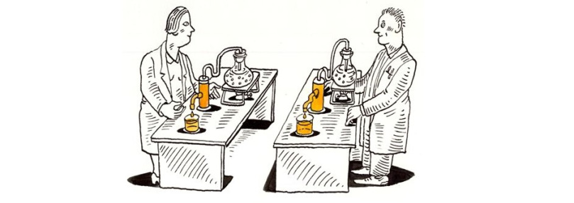
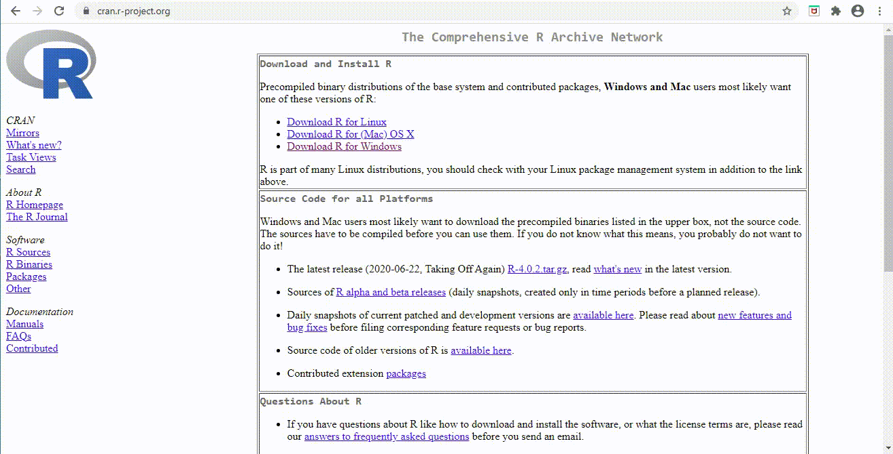
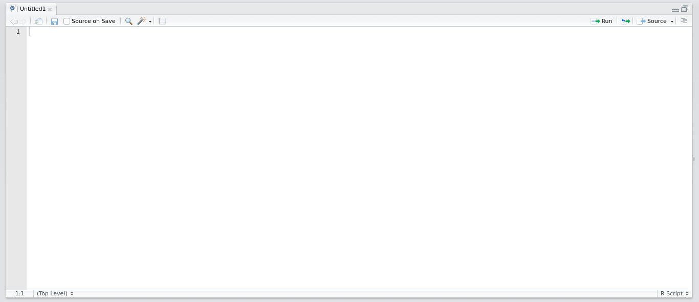
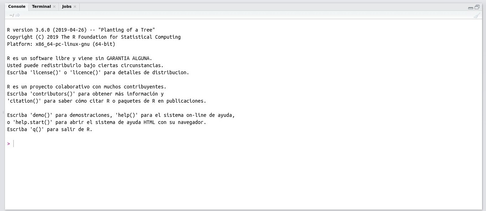
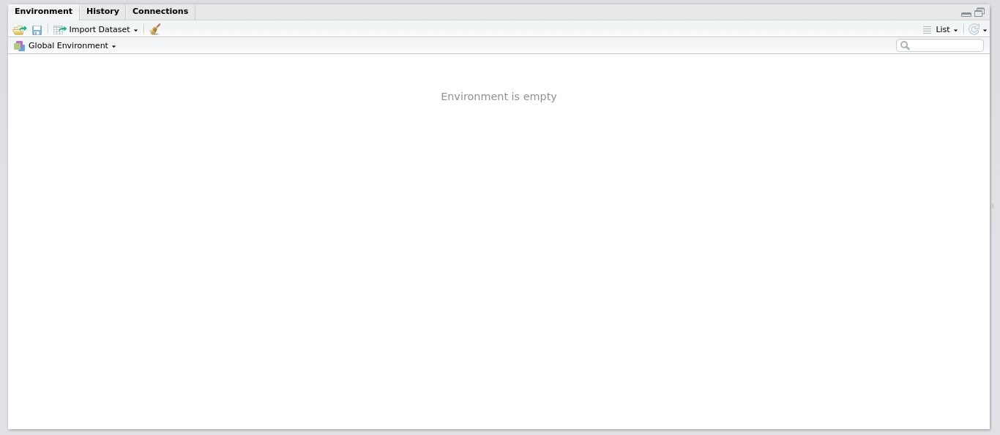
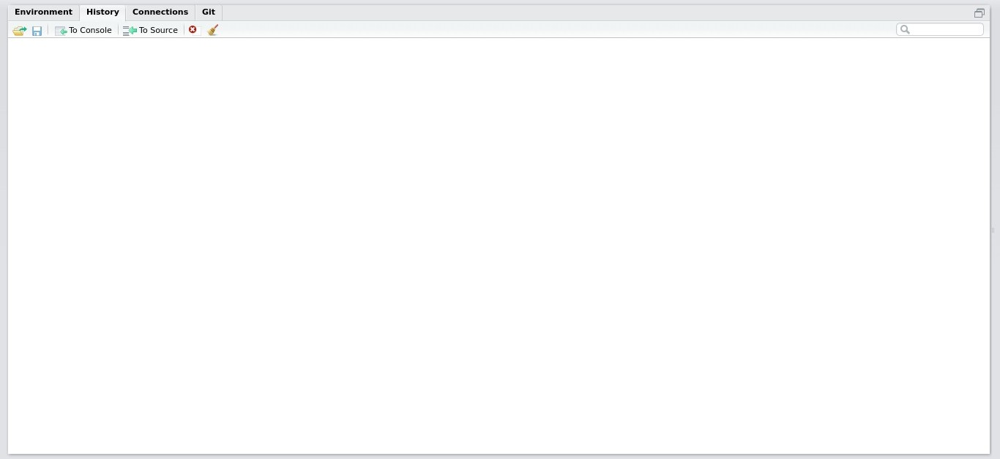
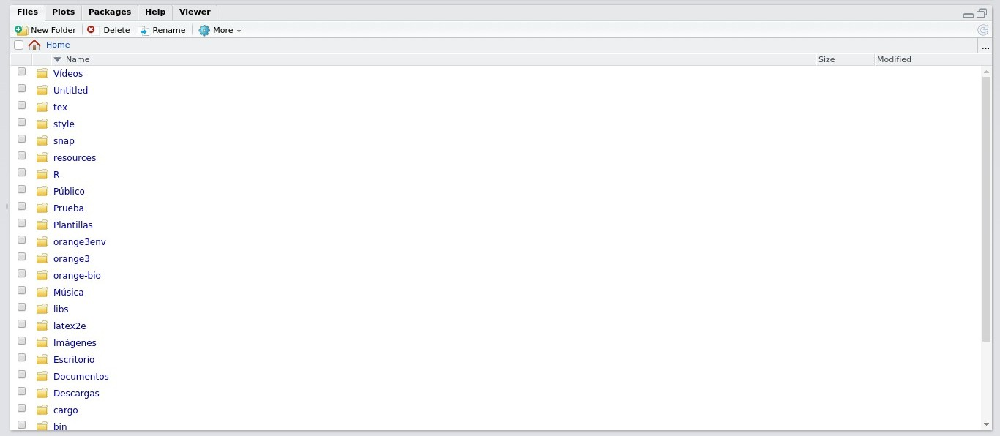
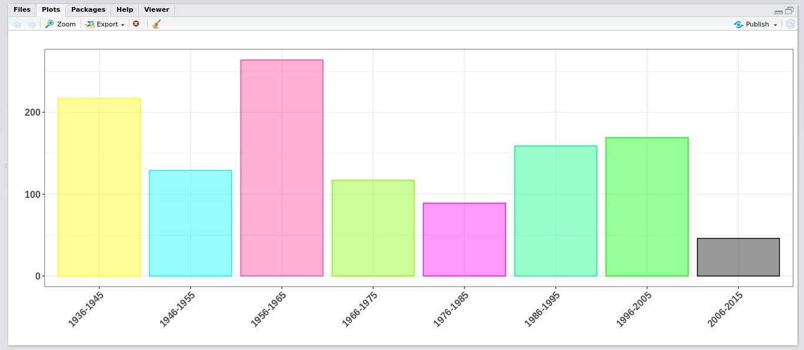
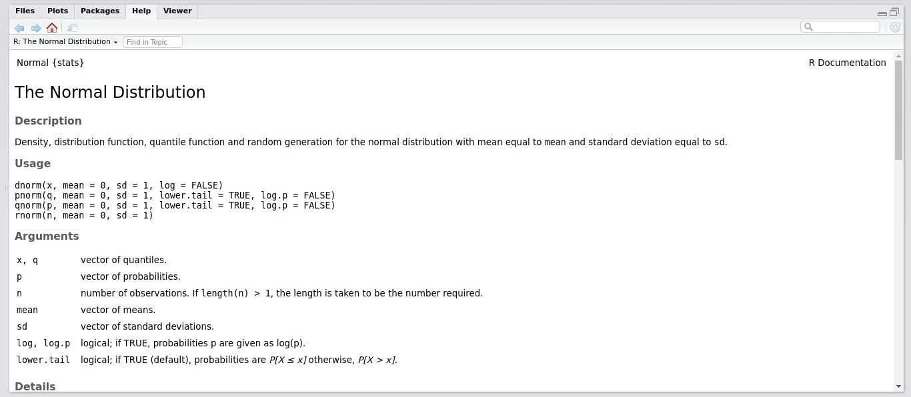
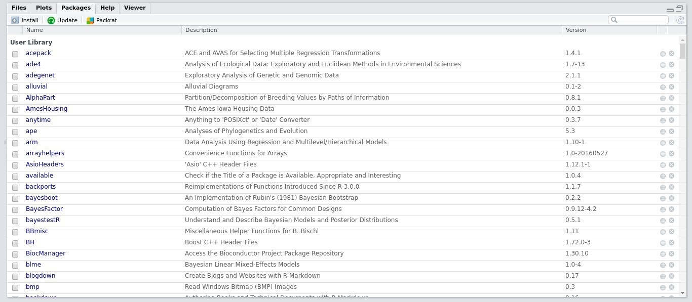

class: center, inverse

background-image: url(img/R_feliz.png)
background-position: 50% 70%
background-size: 60%

# ¿Qué es el lenguaje de programación
# `R` y por qué usarlo?

```{r setup, echo=FALSE}
library(xaringanExtra)
library(flair)
library(knitr)
```

```{r xaringan-panelset, echo=FALSE}
xaringanExtra::use_panelset()
```

```{css, echo=FALSE}
pre {
  max-width: 100%;
  overflow-x: scroll;
}
.inverse {
  background-color: #272822;
  color: #d6d6d6;
  text-shadow: 0 0 20px #333;
}
```

```{r xaringanExtra-share-again, echo=FALSE}
xaringanExtra::use_share_again()
```

---

```{r, eval = TRUE, echo = FALSE, message = FALSE, fig.align = 'center', out.width = '380'}
include_graphics('img/al_principio_pero_ahora.jpg')
```

<section style="text-align: center;"><small>Ilustracíon hecha por <font color = "black"><u>@allison_horst</u></font>.</small></section>

<P align="justify">Los lenguajes de programación como el `R` no son sencillos de aprender, pero con trabajo y motivación verá como en poco tiempo se lograrán grandes avances.</p>

---
class: inverse

# Objetivos de la lección

--

- <P align="justify">***Revisaremos*** algunas características del programa `R` que es compartida por otros lenguajes de programación.</p>

<br>
--

- <P align="justify">***Hablaremos*** sobre ¿por qué usar el `R`?, donde se introducira la importancia de la comunidad del `R`.</p>

<br>
--

- <P align="justify">***Aprenderemos*** sobre como se debe instalar tanto el `R` base como el RStudio.</p>

---

# El lenguaje de programación `R`

<P align="justify">El `R` es un programa para el análisis estadístico, creado en el año de 1902 por Robert Gentleman y Ross Ihaka. Ambos creadores de este programa le dieron el nombre de `R` al lenguaje implementado por las iniciales de sus nombres (a modo de broma).</p>

<br>

```{r, eval = TRUE, echo = FALSE, message = FALSE, fig.align = 'center', out.width = '380'}
include_graphics('img/Creadores.jpg')
```

---

# El lenguaje de programación `R`

Algunas características del lenguaje de programación `R` son:

--

+ <P align="justify">Es un Lenguaje de programación __interpretado__, debido a que se ejecuta usando un programa intermedio llamado __intérprete__ (RStudio preferiblemente).</p>

--

+ <P align="justify">Es un lenguaje de programación __orientado a objetos__.</p>

```{r, eval = TRUE, echo = FALSE, message = FALSE, fig.align = 'center', out.width = '280'}
include_graphics('img/objetos_R.png')
```

--

+ <P align="justify">El intérprete del `R` está disponible en __muchas plataformas__ (como Linux y Windows), por lo que el `R`  podrá ejecutarse en muchos computadores.</p>

---

background-image: url(img/rladies_medellin.png)
background-position: 90% 5%
background-size: 14%

# ¿Por qué usar el programa `R`?

--

+ <P align="justify">El lenguaje de programación `R` se puede obtener y distribuir de forma gratuita, debido a que se encuentra bajo __Licencia Pública General__. Por lo tanto es un programa de código abierto y gratis.</p>

--

.pull-left[
+ <P align="justify">El programa `R` cuenta con una __comunidad__ de usuarios alrededor del mundo.</p>
]

.pull-right[
.center[
```{r echo = FALSE, out.width = "80%"}
knitr::include_graphics("img/Rday.jpg")
```
]
]

--

+ <P align="justify">El uso del programa `R` garantiza que otro investigador pueda repetir su invetigación (**investigación reproducible**).</p>

.right[
```{r echo = FALSE, out.width = "40%"}

```
]

---

# Instalación de `R` base y de RStudio

.pull-left[
### `R` base
<P align="justify">El programa `R` por si solo (conocido como `R` base) es el software básico que contiene el lenguaje de programación `R`. Este es mantenido por un equipo internacional de desarrolladores, los cuales permiten que el lenguaje se encuentre disponible a través de una página web conocida como la CRAN.</p>
]

.pull-right[
### RStudio
<P align="justify">RStudio es un software que facilita la programación en `R`. Es un entorno de desarrollo integrado (IDE) para el lenguaje de programación `R`, el cual puede incluir una consola y un editor de sintaxis que apoya la ejecución de código.</p>
.right[
```{r echo = FALSE, out.width = "50%"}
knitr::include_graphics("img/RStudio_2.jpg")
```
<section style="text-align: center;"><small>Ilustracíon hecha por <font color = "black"><u>@allison_horst</u></font>.</small></section>
]
]

---

# Instalación de `R` base y de RStudio

### `R` base

```{r echo = FALSE, out.width = "100%"}

```

---

# Instalación de `R` base y de RStudio

### `R` base

```{r echo = FALSE, out.width = "80%", fig.align = 'center'}
knitr::include_graphics("img/consola_R_base.jpg")
```

---

# Instalación de `R` base y de RStudio

### RStudio

```{r echo = FALSE, out.width = "100%"}
knitr::include_graphics("img/rstudio.gif")
```

---

# Instalación de `R` base y de RStudio

### RStudio - la fuente

```{r echo = FALSE, out.width = "100%", fig.align = 'center'}

```

---

# Instalación de `R` base y de RStudio

### RStudio - la consola

```{r echo = FALSE, out.width = "100%", fig.align = 'center'}

```

---

# Instalación de `R` base y de RStudio

### RStudio - el ambiente y el historial

.pull-left[
.center[
```{r echo = FALSE, out.width = "100%", fig.align = 'center'}

```
]
]

.pull-right[
.center[
```{r echo = FALSE, out.width = "100%", fig.align = 'center'}

```
]
]

---

# Instalación de `R` base y de RStudio

### RStudio - los archivos, las gráficas, la ayuda y los paquetes

.center[
.pull-left[
```{r echo = FALSE, out.width = "90%", fig.align = 'center'}

```
]

.pull-right[
```{r echo = FALSE, out.width = "90%", fig.align = 'center'}

```
]
]

.center[
.pull-left[
```{r echo = FALSE, out.width = "90%", fig.align = 'center'}

```
]

.pull-right[
```{r echo = FALSE, out.width = "90%", fig.align = 'center'}

```
]
]

---

class:inverse
# Recursos de interés

- [Aquí](https://cran.r-project.org/) encontrará el enlace del CRAN para instalar el `R` base.

<br>
- [Aquí](https://rstudio.com/) encontrará el enlace de la página en donde podrá instalar RStudio.