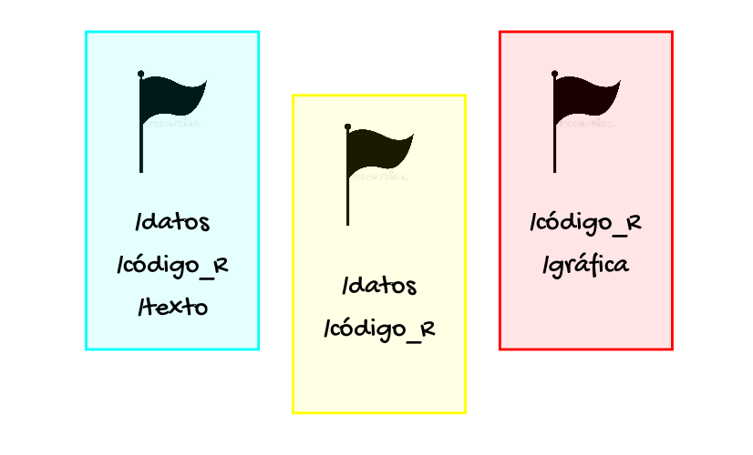

class: center

background-image: url(img/Proyectos.png)
background-position: 50% 80%
background-size: 50%

# Los paquetes en `R` y el trabajo
# con proyectos

```{r setup, echo=FALSE}

library(xaringanExtra)
library(flair)
library(knitr)
library(tibble)
library(gt)
```

```{r xaringan-panelset, echo=FALSE}
xaringanExtra::use_panelset()
```

```{css, echo=FALSE}
pre {
  max-width: 100%;
  overflow-x: scroll;
}

.inverse {
  background-color: #272822;
  color: #d6d6d6;
  text-shadow: 0 0 20px #333;
}
```

```{r xaringanExtra-share-again, echo=FALSE}
xaringanExtra::use_share_again()
```

---
class: inverse

# Objetivos de la lección

--

- <P align="justify">***Aprenderemos*** sobre los paquetes en `R` y como instalarlos.</p>

<br>
--

- <P align="justify">***Aprenderemos*** sobre que consiste el trabajo con proyectos.</p>

---

# Los paquetes en `R`

<P align="justify">Los paquetes en `R` consisten de una colección de funciones desarrollados por personas que hacen parte de la comunidad del `R`. Cada paquete puede contener, además de funciones, conjuntos de datos y documentación de como llevar a cabo su uso.</p>

<P align="justify">Existen dos formas de instalar nuevos paquetes en `R`:</p>

+ Descargarlos de la CRAN, por medio de la función `install.packages()`.

.panelset[

.panel[.panel-name[Ejemplo]

.pull-left[
<P align="justify">`r emo::ji("thinking")` Por medio de la función `install.packages()`, intente por favor instalar los paquetes `tidyr`, `dplyr` y `ggplot2`.</p>
]

.pull-right[
.center[
```{r, echo = FALSE, out.width = "34%"}
knitr::include_graphics("img/practica.jpg")
```
]
]
]

.panel[.panel-name[Código]

```{r, eval = FALSE}

install.packages('tidyr', 'dplyr', 'ggplot2')
```
]

]

---

# Los paquetes en `R`

<P align="justify">Los paquetes en `R` consisten de una colección de funciones desarrollados por personas que hacen parte de la comunidad del `R`. Cada paquete puede contener, además de funciones, conjuntos de datos y documentación de como llevar a cabo su uso.</p>

<P align="justify">Existen dos formas de instalar nuevos paquetes en `R`:</p>

+ <P align="justify">Usando el paquete `devtools`, el cual permite instalar paquetes alojados en distintos servidores, como [Bioconductor](https://www.bioconductor.org/) (`install_bioc()`), [CRAN](https://cran.r-project.org/index.html) (`install_cran()`), [git](https://git-scm.com/) (`install_git()`) y [GitHub](https://github.com/) (`install_github()`).</p>

.panelset[

.panel[.panel-name[Ejemplo]

.pull-left[
<P align="justify">`r emo::ji("thinking")` Por medio del paquete `devtools`, intente por favor instalar el paquete `dplyr`.</p>
]

.pull-right[
.center[
```{r, echo = FALSE, out.width = "28%"}
knitr::include_graphics("img/practica.jpg")
```
]
]
]

.panel[.panel-name[Código]

```{r, eval = FALSE}

install.packages('devtools')
devtools::install_github('tidyverse/dplyr')
```
]

]

---

# Los paquetes en `R`

<P align="justify">Los paquetes en `R` consisten de una colección de funciones desarrollados por personas que hacen parte de la comunidad del `R`. Cada paquete puede contener, además de funciones, conjuntos de datos y documentación de como llevar a cabo su uso.</p>

<P align="justify">Si se desea usar un paquete del `R` ya instalado, se pueden usar igualmente dos formas:</p>

+ <P align="justify">Por medio de la notación `nombre_paquete::nombre_función`, si se desea hacer un uso temporal del paquete.</p>

.panelset[

.panel[.panel-name[Ejemplo]

.pull-left[
<P align="justify">`r emo::ji("thinking")` Por medio de la notación anterior, intente por favor cargar temporalmente el paquete `dplyr` con el fin de acceder al conjunto de datos `starwars` de ese paquete.</p>
]

.pull-right[
.center[
```{r, echo = FALSE, out.width = "28%"}

knitr::include_graphics("img/practica.jpg")
```
]
]
]

.panel[.panel-name[Código]

```{r, eval = FALSE}

dplyr::starwars
```
]

]

---

# Los paquetes en `R`

<P align="justify">Los paquetes en `R` consisten de una colección de funciones desarrollados por personas que hacen parte de la comunidad del `R`. Cada paquete puede contener, además de funciones, conjuntos de datos y documentación de como llevar a cabo su uso.</p>

<P align="justify">Si se desea usar un paquete del `R` ya instalado, se pueden usar igualmente dos formas:</p>

+ <P align="justify">Cargandolo usando la función `library()`, si se desea hacer un uso permanente de las funciones y otros materiales proporcionados por un paquete.</p>

.panelset[

.panel[.panel-name[Ejemplo]

.pull-left[
<P align="justify">`r emo::ji("thinking")` Haciendo uso de la función `library()`, intente por favor cargar el paquete `dplyr` y posteriormente acceder al conjunto de datos `starwars`.</p>
]

.pull-right[
.center[
```{r, echo = FALSE, out.width = "24%"}

knitr::include_graphics("img/practica.jpg")
```
]
]
]

.panel[.panel-name[Código]

```{r, eval = FALSE}

library(dplyr)
starwars
```
]

]

---

# Los paquetes en `R`

<P align="justify">Los paquetes en `R` consisten de una colección de funciones desarrollados por personas que hacen parte de la comunidad del `R`. Cada paquete puede contener, además de funciones, conjuntos de datos y documentación de como llevar a cabo su uso.</p>

<P align="justify">En caso de que se desee acceder a la descripción de un paquete del `R`, se pueden emplear la función `packageDescription()`.</p>

.panelset[

.panel[.panel-name[Ejemplo]

.pull-left[
<P align="justify">`r emo::ji("thinking")` Haciendo uso de la función `packageDescription()`, intente por favor acceder a la descripción del paquete `dplyr`.</p>

<P align="justify">`r emo::ji("question")` Qué versión del paquete `dplyr` de acuerdo a su descripción tiene instalado?</p>
]

.pull-right[
.center[
```{r, echo = FALSE, out.width = "34%"}

knitr::include_graphics("img/practica.jpg")
```
]
]
]

.panel[.panel-name[Código]

```{r, eval = FALSE}

packageDescription('dplyr')
```
]

.panel[.panel-name[Respuesta]
<P align="justify">`r emo::ji("mag")` La versión del paquete `dplyr` de acuerdo a su descripción, corresponde a la verión 1.0.2.</p>

<P align="justify">`r emo::ji("warning")` La versión de un paquete en `R` puede variar, debido en muchas ocasiones a posibles mejoras. Para actualizar un paquete en `R`, se puede usar la función `update.packages()`.</p>
]

]

---

# Los paquetes en `R`

<P align="justify">Los paquetes en `R` consisten de una colección de funciones desarrollados por personas que hacen parte de la comunidad del `R`. Cada paquete puede contener, además de funciones, conjuntos de datos y documentación de como llevar a cabo su uso.</p>

<P align="justify">Otras funciones que permiten la gestión de los paquetes instalados del `R` son:</p>

```{r, echo = FALSE, eval = TRUE, message = FALSE, fig.align = 'center'}

tribble(
                ~Función,                                                 ~Descripción,
  'installed.packages()',        'Permite ver los paquetes que se tienen instalados.',
     'remove.packages()',               'Permite eliminar algún paquete ya instalado.',
        'old.packages()', 'Permite comprobar que paquetes necesitan ser actualizados.',
      'update.packages()',               'Permite actualizar los paquetes instalados.'
) %>%
  gt()
```

---

# El directorio de trabajo en `R` y el trabajo con proyectos

<P align="justify">Un directorio de trabajo en `R` es el lugar del computador en el que se encuentran los archivos con los que se esta trabajando, y en el que el programa buscara el archivo que se desea importar o exportar.</p>

.center[
```{r, echo = FALSE, out.width = "44%"}


```
]

<P align="justify">El programa `R` cuenta con dos funciones que permiten encontrar el directorio en el que se esta trabajando y cambiar el directorio de trabajo en el que se desea trabajar: las funciones `getwd()` y `setwd()`.</p>

---

# El directorio de trabajo en `R` y el trabajo con proyectos

<P align="justify">Sin embargo al usar las funciones `getwd()` y `setwd()`, es practicamente imposible para cualquier otra persona que no sea el autor original del código `R`, en su computadora, hacer que el código funcione en caso de que se halla usado rutas de archivo. La solución a esto consiste el trabajo con __proyectos__.</p>

<P align="justify">Un proyecto es un directorio de trabajo designado como un archivo con extensión __.Rproj__. Cuando se abre ese proyecto, el directorio de trabajo se establecerá automáticamente en la carpeta donde se encuentra ese archivo.</p>

.panelset[

.panel[.panel-name[Ejemplo]

.pull-left[
<P align="justify">`r emo::ji("thinking")` Intente por favor crear un proyecto en su computadora. Es fácil, siga los siguentes pasos:</p>

.center[
```{r across-spec-color-coded, echo = FALSE}
decorate('File → New Project...' , error = TRUE, eval = FALSE) %>% 
  flair('File', color = 'cyan') %>% 
  flair('New Project...', color = 'red')
```
]

]

.pull-right[

.center[
```{r, echo = FALSE, out.width = "27%"}

knitr::include_graphics("img/practica.jpg")
```
]

]

]

]

---

# El directorio de trabajo en `R` y el trabajo con proyectos

.center[
```{r, echo = FALSE, out.width = "56%"}


```

<section style="text-align: center;"><small>Ilustracíon hecha por <font color = "black"><u>@allison_horst</u></font>.</small></section>
]
