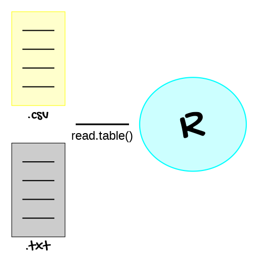

class: center

background-image: url(img/matriz_dato.png)
background-position: 50% 70%
background-size: 44%

# Matrices y conjuntos de datos

```{r setup, echo=FALSE}

library(xaringanExtra)
library(flair)
library(knitr)
library(tibble)
library(gt)
```

```{r xaringan-panelset, echo=FALSE}
xaringanExtra::use_panelset()
```

```{css, echo=FALSE}
pre {
  max-width: 100%;
  overflow-x: scroll;
}

.inverse {
  background-color: #272822;
  color: #d6d6d6;
  text-shadow: 0 0 20px #333;
}
```

```{r xaringanExtra-share-again, echo=FALSE}
xaringanExtra::use_share_again()
```

---
class: inverse

# Objetivos de la lección

--

- <P align="justify">***Hablaremos*** sobre las matrices y conjuntos de datos.</p>

<br>
--

- <P align="justify">***Aprenderemos*** sobre las distintas formas de extraer información de las matrices y conjuntos de datos.</p>

<br>
--

- <P align="justify">***Aprenderemos*** sobre como se puede leer o importar un conjunto de datos en `R`.</p>

---

# Matrices y conjuntos de datos

<P align="justify">Las matrices y los conjuntos son arreglos rectangulares de filas y columnas. Si bien las matrices y los conjuntos de datos se ven muy similares, dada su estructura tabular, no son exactamente lo mismo: las matrices pueden contener solo una clase de datos (ya sea numérico o carácter por ejemplo), mientras que los conjuntos de datos pueden contener columnas tanto numéricas como de caracteres.</p>

.center[
```{r, echo = FALSE, out.width = "54%"}
knitr::include_graphics("img/matriz_dato_2.png")
```
]

---

# Matrices y conjuntos de datos

<P align="justify">Existen distintas formas de crear matrices y conjuntos de datos en `R`:</p>

<small>

```{r, echo = FALSE, eval = TRUE, message = FALSE, fig.align = 'center'}

tribble(
  ~Función, ~Descripción, ~Ejemplo,
  'cbind(a, b, c)', 'Combina vectores como columnas en una matriz.', 'cbind(1:3, 4:6, 7:9)',
  'rbind(a, b, c)', 'Combina vectores como filas en una matriz.', 'rbind(1:3, 4:6, 7:9)',
  'matrix(data, nrow, ncol, byrow)', 'Crea una matriz a partir de un vector.', 'matrix(data = 1:9, nrow = 3, ncol = 3)',
  'data.frame()', 'Crea un conjunto de datos a partir de columnas con un nombre', 'data.frame("Edad" = c(19, 21), "Sexo" = c("M", "F"))'
  ) %>%
  gt()
```

</small>

.panelset[

.panel[.panel-name[Ejemplo]

.pull-left[
<P align="justify">`r emo::ji("geek")` Intente por favor crear las matrices y el conjunto de datos presentados en la tabla anterior.<br>
</p>
]

.pull-right[
.center[
```{r, echo = FALSE, out.width = "14%"}
knitr::include_graphics("img/practica.jpg")
```
]
]
]

.panel[.panel-name[Código]

```{r, eval = FALSE}

cbind(1:3, 4:6, 7:9)
rbind(1:3, 4:6, 7:9)
matrix(data = 1:9, nrow = 3, ncol = 3)
data.frame("Edad" = c(19, 21), "Sexo" = c("M", "F"))
```
]

```{r crear_matriz_1, eval = FALSE}

cbind(1:3, 4:6, 7:9)
```

.panel[.panel-name[Resultado 1]

```{r ref.label = "crear_matriz_1", echo = FALSE, message = FALSE}

```
]

```{r crear_matriz_2, eval = FALSE}

rbind(1:3, 4:6, 7:9)
```

.panel[.panel-name[Resultado 2]

```{r ref.label = "crear_matriz_2", echo = FALSE, message = FALSE}

```
]

```{r crear_matriz_3, eval = FALSE}

matrix(data = 1:9, nrow = 3, ncol = 3)
```

.panel[.panel-name[Resultado 3]

```{r ref.label = "crear_matriz_3", echo = FALSE, message = FALSE}

```
]

```{r crear_matriz_4, eval = FALSE}

data.frame("Edad" = c(19, 21), "Sexo" = c("M", "F"))
```

.panel[.panel-name[Resultado 4]

```{r ref.label = "crear_matriz_4", echo = FALSE, message = FALSE}

```
]

]

---

# Conjuntos de datos

<P align="justify">El lenguaje de programación `R` contiene conjuntos de datos ya instalados en un paquete llamado `datasets`. Este paquete no requiere ser instalado puesto que ya viene incluido en el `R` base. Algunos de estos conjuntos de datos son:</p>

<small>

```{r, echo = FALSE, eval = TRUE, message = FALSE, fig.align = 'center'}

tribble(
  ~'Conjuntos de datos', ~Descripción,
  'iris', 'Conjunto de datos sobre medidas en características morfológicas de tres especies de la flor iris.',
  'mtcars', 'Conjunto de datos sobre el consumo de combustible y aspecto del diseño y rendimiento en automoviles.',
  'insectSprays', 'Conjunto de datos sobre conteo de insectos tratados con insecticidas.',
  'Titanic', 'Conjunto de datos que proporciona información sobre el destino de los pasajeros del viaje inagural del Titanic'
  ) %>%
  gt()
```

</small>

.panelset[

.panel[.panel-name[Ejemplo]

.pull-left[
<P align="justify">`r emo::ji("megaphone")` Para cargar un conjunto de datos especifico, se puede hacer uso de la función `data()`.</p>
]

.pull-right[
<P align="justify">`r emo::ji("geek")` Intente por favor cargar el conjunto de datos `iris` descrito en la tabla anterior.</p>
]

]

.panel[.panel-name[Código]

```{r, eval = FALSE}

data('iris')
```
]

]

---

# Conjuntos de datos

<P align="justify">También pueden existir conjuntos de datos disponibles dentro de paquetes del `R`. Algunos de estos conjuntos de datos son:</p>

<small>

```{r, echo = FALSE, eval = TRUE, message = FALSE, fig.align = 'center'}

tribble(
  ~'Conjuntos de datos', ~Paquete, ~Descripción,
  'penguins', 'palmerpenguins', 'Conjunto de datos sobre medidas en características morfológicas en pingüinos de genero Pygoscelis.',
  'gapminder', 'gapminder', 'Conjunto de datos que proporciona información sobre indicadores o datos socioeconómicos a través del tiempo.',
  'starwars', 'dplyr', 'Conjunto de datos que proporciona información sobre características de los personajes de la serie star wars.',
  ) %>%
  gt()
```

</small>

.panelset[

.panel[.panel-name[Ejemplo]

.pull-left[
<P align="justify">`r emo::ji("thinking")` Haciendo uso de la función `data()`, intente por favor cargar el cojunto de datos `star wars` del paquete `dplyr`. Para ello, necesitará previamente cargar ese paquete.</p>
]

.pull-right[
.center[
```{r, echo = FALSE, out.width = "22%"}
knitr::include_graphics("img/practica.jpg")
```
]
]

]

.panel[.panel-name[Código]

```{r, eval = FALSE}

library(dplyr)
data('starwars')
```
]

]

---

# Conjuntos de datos

<P align="justify">El lenguaje de programación `R` contiene funciones que proporcionan información sobre conjuntos de datos. Estas funciones son:</p>

<small>

```{r, echo = FALSE, eval = TRUE, message = FALSE, fig.align = 'center'}

tribble(
  ~'Conjuntos de datos', ~Descripción,
  'head(x), tail(x)', 'Imprime las primeras y últimas filas del conjunto de datos.',
  'dim(x)', 'Cuenta el número de filas y de columnas de un conjunto de datos.',
  'names(x)', 'Muestra los nombres de las filas y las columnas de un conjunto de datos.',
  'str(object), summary(object)', 'Muestra la estructura del conjunto de datos (y estadísticas).',
  ) %>%
  gt()
```

</small>

.panelset[

.panel[.panel-name[Ejemplo]

.pull-left[
<P align="justify">`r emo::ji("thinking")` Haciendo uso de la función `names()` de la tabla anterior, intente por favor mostrar el nombre de cada columna o variable del conjunto de datos `iris`.</p>
]

.pull-right[
.center[
```{r, echo = FALSE, out.width = "20%"}
knitr::include_graphics("img/practica.jpg")
```
]
]

]

.panel[.panel-name[Código]

```{r nombre_iris, eval = FALSE}

data('iris')
names(x = iris)
```
]

.panel[.panel-name[Resultado]

```{r ref.label = "nombre_iris", echo = FALSE, message = FALSE}

```
]

]

---

# Acceso a la información en matrices y conjuntos de datos

<P align="justify">Para acceder a la información contenida dentro de una matriz o conjunto de datos, se puede usar la __indexación__ mediante el uso del operador `[ ]`. Esta indexación puede ser de dos tipos:</p>

+ Indexación numérica

<P align="justify">La indexación numérica permite acceder al elemento de una matriz y conjunto de datos de acuerdo a su posición. Para ello, el operador `[ ]` requiere de dos argumentos: el primero que hace referencia a la posición en las filas, y el segundo que hace referencia a la posición en las columnas.</p>

.panelset[

.panel[.panel-name[Ejemplo]

.pull-left[
<P align="justify">`r emo::ji("thinking")` Intente por favor crear una matriz con los números del `1` al `9`. Luego, seleccione toda la fila `3`, toda la columna `3`, y por último el elemento de la fila `3` y la columna `2`.</p>
]

.pull-right[
.center[
```{r, echo = FALSE, out.width = "20%"}
knitr::include_graphics("img/practica.jpg")
```
]
]

]

.panel[.panel-name[Código]

```{r indice_MC, eval = FALSE}

A <- matrix(data = 1:9, nrow = 3, ncol = 3)
A[3, ]
A[, 3]
A[3, 2]
```
]

.panel[.panel-name[Resultado]

```{r ref.label = "indice_MC", echo = FALSE, message = FALSE}

```
]

]

---

# Acceso a la información en matrices y conjuntos de datos

<P align="justify">Para acceder a la información contenida dentro de una matriz o conjunto de datos, se puede usar la __indexación__ mediante el uso del operador `[ ]`. Esta indexación puede ser de dos tipos:</p>

+ Indexación lógica

<P align="justify">La indexación lógica en matrices y conjuntos de datos hace referencia a la selección de alguno de sus elementos de acuerdo una condición establecida. Para ello, se usan los denominados __operadores lógicos__ u operadores de comparación:</p>

.pull-left[

<small>

```{r, echo = FALSE, eval = TRUE, message = FALSE, fig.align = 'center'}

tribble(
  ~Operador,      ~Significado,
       '==',         'Igual a',
       '!=',    'Diferente de',
        '<',         'Menor a',
       '<=', 'Menor e igual a',
        '>',         'Mayor a'
  ) %>%
  gt()
```

</small>

]

.pull-right[
<small>

```{r, echo = FALSE, eval = TRUE, message = FALSE, fig.align = 'center'}

tribble(
  ~Operador,      ~Significado,
       '>=', 'Mayor e igual a',
        '|',               'ó',
        '&',               'y',
        '!',              'no'
  ) %>%
  gt()
```
]

---

# Acceso a la información en matrices y conjuntos de datos

<P align="justify">Para acceder a la información contenida dentro de una matriz o conjunto de datos, se puede usar la __indexación__ mediante el uso del operador `[ ]`. Esta indexación puede ser de dos tipos:</p>

+ Indexación lógica

.panelset[

.panel[.panel-name[Ejemplo]

.pull-left[
<P align="justify">`r emo::ji("thinking")` Intente por favor seleccionar del conjunto de datos `starwars` del paquete `dplyr`, solo aquellos individuos cuya `especie` es `humana`.</p>
<P align="justify">`r emo::ji("geek")` Para ello necesitara primero cargar ese paquete, y luego acceder al conjunto de datos por medio de la función `data()`.
]

.pull-right[
.center[
```{r, echo = FALSE, out.width = "44%"}

```
]
]

]

.panel[.panel-name[Código]

```{r indice_MC_2, eval = FALSE}

library(dplyr)
data('starwars')
starwars[starwars[, 'species'] == 'Human', ]
```
]

]

---

# Acceso a la información en matrices y conjuntos de datos

<P align="justify">Otra forma de acceder a la información contenida dentro de una matriz o conjunto de datos es mediante el __nombre de las columnas__. Para esto, se puede emplear el operador `$` de la forma `a$nombre`, donde `a` corresponde al nombre de dichos objetos y `nombre` hace referencia al nombre de la columna.</p>

.panelset[

.panel[.panel-name[Ejemplo]

.pull-left[
<P align="justify">`r emo::ji("thinking")` Haciendo uso del nombre de la columna que hace referencia a la `especie` del conjunto de datos `starwars`, intente por favor seleccionar solo aquellos individuos cuya `especie` es `humana`.</p>

<P align="justify">`r emo::ji("spock")` Recuerde la función `names()`. Usela para conocer el nombre de la columna que hace referencia a la especie de los individuos.</p>
]

.pull-right[
.center[
```{r, echo = FALSE, out.width = "44%"}

```
]
]

]

.panel[.panel-name[Código]

```{r indice_MC_3, eval = FALSE}

library(dplyr)
data('starwars')
names(x = starwars)
starwars[starwars$species == 'Human', ]
```
]

]

---

# Acceso a la información en matrices y conjuntos de datos

<P align="justify">La función `subset()` proporciona otra forma de acceder a la información dentro de un conjunto de datos, mediante una codificación que es fácil de escribir y de leer. La estructura de esta función es:</p>

.center[
```{r, echo = FALSE}
decorate('subset(x, subset, select)', error = TRUE, eval=FALSE) %>% 
  flair('x', color = 'cornflowerblue') %>% 
  flair('subset', color = 'red') %>% 
  flair('select', color = 'orange')
```
]

<small>
<span style="color: cornflowerblue">`x`</span> = conjunto de datos del que se desea extraer los datos.<br>
<span style="color: red">`subset`</span> = condición que establece los datos que se desean seleccionar.<br>
<span style="color: orange">`select`</span> = columnas que se desean conservar.
</small>

.panelset[

.panel[.panel-name[Ejemplo 1]

.pull-left[
<P align="justify">`r emo::ji("thinking")` Intente por favor extraer del conjunto de datos `starwars`, solo los individuos cuya `especie` es `humana`.</p>
]

.pull-right[
.center[
```{r, echo = FALSE, out.width = "24%"}
knitr::include_graphics("img/practica.jpg")
```
]
]

]

.panel[.panel-name[Código 1]

```{r indice_MC_4, eval = FALSE}

library(dplyr)
data('starwars')
subset(x = starwars, subset = species == 'Human')
```
]

.panel[.panel-name[Ejemplo 2]

.pull-left[
<P align="justify">`r emo::ji("thinking")` Intente por favor extraer del conjunto de datos `starwars`, aquellos individuos de `especie` `humana` y que no nacieron en `Tatooine`.</p>
]

.pull-right[
.center[
```{r, echo = FALSE, out.width = "24%"}
knitr::include_graphics("img/practica.jpg")
```
]
]

]

.panel[.panel-name[Código 2]

```{r indice_MC_5, eval = FALSE}

library(dplyr)
data('starwars')
subset(x = starwars, subset = species == 'Human' & homeworld != 'Tatooine')
```
]

]

---

# Lectura de conjuntos de datos

<P align="justify">Por lo general, los conjuntos de datos que van a ser importados en el programa `R` se almacenan en dos formatos: archivos con extensión __.csv__ y archivos con extensión __.txt__.</p>

```{r, echo = FALSE, eval = FALSE, message = FALSE, fig.showtext = TRUE}

library(ggplot2)
library(showtext)
font_add_google('Gochi Hand', 'gochi')
library(ggforce)

circulo <- data.frame(
  x = 1.85, 
  y = 1.9,
  grupo = 'A'
)

ggplot() +
  geom_blank() +
  annotate(geom = 'rect', xmin = 1.0, xmax = 1.25, ymin = 2.5, ymax = 2.0, colour = 'yellow', fill = 'yellow', alpha = 0.2) +
  annotate(geom = 'text', x = 1.125, y = 1.95, label = '.csv', family = 'gochi', size = 10.4, colour = 'black') +
  annotate(geom = 'segment', x = 1.05, xend = 1.20, y = 2.4, yend = 2.4, colour = 'black', size = 1.0) +
  annotate(geom = 'segment', x = 1.05, xend = 1.20, y = 2.3, yend = 2.3, colour = 'black', size = 1.0) +
  annotate(geom = 'segment', x = 1.05, xend = 1.20, y = 2.2, yend = 2.2, colour = 'black', size = 1.0) +
  annotate(geom = 'segment', x = 1.05, xend = 1.20, y = 2.1, yend = 2.1, colour = 'black', size = 1.0) +
  annotate(geom = 'rect', xmin = 1.0, xmax = 1.25, ymin = 1.3, ymax = 1.8, colour = 'black', fill = 'black', alpha = 0.2) +
  annotate(geom = 'text', x = 1.125, y = 1.25, label = '.txt', family = 'gochi', size = 10.4, colour = 'black') +
  annotate(geom = 'segment', x = 1.05, xend = 1.20, y = 1.7, yend = 1.7, colour = 'black', size = 1.0) +
  annotate(geom = 'segment', x = 1.05, xend = 1.20, y = 1.6, yend = 1.6, colour = 'black', size = 1.0) +
  annotate(geom = 'segment', x = 1.05, xend = 1.20, y = 1.5, yend = 1.5, colour = 'black', size = 1.0) +
  annotate(geom = 'segment', x = 1.05, xend = 1.20, y = 1.4, yend = 1.4, colour = 'black', size = 1.0) +
  geom_circle(data = circulo, aes(x0 = x, y0 = y, r = 0.25), colour = 'cyan', fill = 'cyan', alpha = 0.2, size = 1.0) +
  annotate(geom = 'text', x = 1.85, y = 1.9, label = 'R', family = 'gochi', size = 32.4, colour = 'black') +
  annotate(geom = 'segment', x = 1.3, xend = 1.55, y = 1.9, yend = 1.9, colour = 'black', size = 1.5) +
  annotate(geom = 'text', x = 1.425, y = 1.84, label = 'read.table()', size = 8.4, colour = 'black') +
  theme_void() +
  theme(axis.text = element_blank(),
        axis.ticks = element_blank(),
        axis.title = element_blank())
```

.center[
```{r, echo = FALSE, out.width = "44%"}

```
]

<P align="justify">Independientemente del tipo de formato con que se almacene un conjunto de dato, se puede emplear una sola función del programa `R` para llevar a cabo su lectura: la función `read.table()`.</p>

---

# Lectura de conjuntos de datos

<P align="justify">La estructura de la función `read.table()` es:</p>

.center[
```{r, echo = FALSE}
decorate('read.table(file, header, sep, dec)', error = TRUE, eval=FALSE) %>% 
  flair('file', color = 'cornflowerblue') %>% 
  flair('header', color = 'red') %>% 
  flair('sep', color = 'yellow') %>% 
  flair('dec', color = 'green')
```
]

<small>
<span style="color: cornflowerblue">`file`</span> = ruta en donde se encuentra el conjunto de datos.<br>
<span style="color: red">`header`</span> = valor lógico que indica si las columnas del conjunto de datos tienen nombre.<br>
<span style="color: yelloe">`sep`</span> = indica el tipo de separación de los datos.<br>
<span style="color: green">`dec`</span> = indica si los números con valor decimal estan separados por coma (`,`) o por punto (`.`).
</small>

.panelset[

.panel[.panel-name[Ejemplo]

.pull-left[
<P align="justify">`r emo::ji("geek")` Descargue por favor [aquí]() el conjunto de datos `starwars` tanto con extensión __.csv__ y __.txt__. Luego intente importar ambos archivos usando la función `read.table()`.</p>

```{r, echo = FALSE, eval = FALSE, message = FALSE}

library(downloadthis)
library(dplyr)
data('starwars')

starwars <- starwars %>%
  select(-c(12:14)) %>%
  download_this(
    output_name = 'starwars',
    output_extension = '.csv',
    button_label = 'Descargar datos starwars',
    button_type = 'warning',
    has_icon = TRUE,
    icon = 'fa fa-download'
  )
```

]

.pull-right[
.center[
```{r, echo = FALSE, out.width = "24%"}
knitr::include_graphics("img/practica.jpg")
```
]
]

]

.panel[.panel-name[Código]

```{r, eval = FALSE}

read.table(file = 'starwars.csv', header = TRUE, sep = ',')
read.table(file = 'starwars.txt', header = TRUE, sep = ' ')
```
]

]
